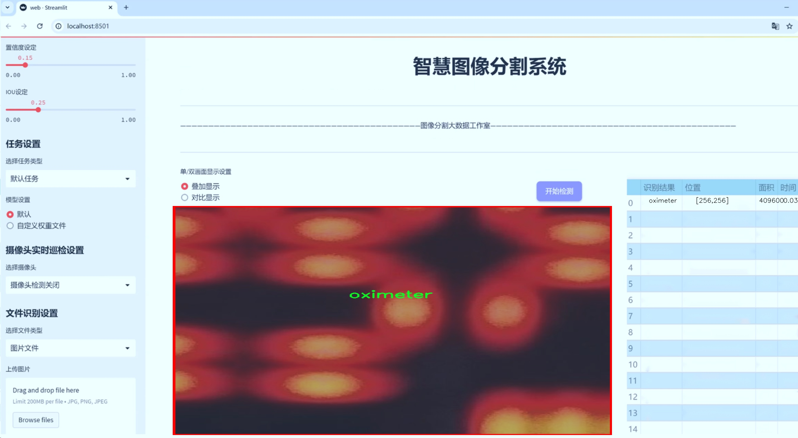

# 医疗设备显示器图像分割系统： yolov8-seg-C2f-SCConv

### 1.研究背景与意义

[参考博客](https://gitee.com/YOLOv8_YOLOv11_Segmentation_Studio/projects)

[博客来源](https://kdocs.cn/l/cszuIiCKVNis)

研究背景与意义

随着医疗技术的迅速发展，医疗设备的智能化和自动化程度不断提高，尤其是在图像处理和分析领域。医疗设备显示器作为医疗工作中不可或缺的一部分，其图像的准确识别与分割对于提高医疗服务质量、保障患者安全具有重要意义。传统的图像处理方法在复杂环境下往往难以实现高效、准确的目标检测和分割，因此，基于深度学习的图像分割技术逐渐成为研究的热点。

YOLO（You Only Look Once）系列模型因其优越的实时性和准确性，广泛应用于目标检测任务。YOLOv8作为该系列的最新版本，结合了更为先进的网络结构和优化算法，能够在保持高精度的同时，显著提高处理速度。然而，针对医疗设备显示器的图像分割任务，现有的YOLOv8模型仍存在一定的局限性，尤其是在复杂背景下的目标识别和分割精度方面。因此，改进YOLOv8模型以适应医疗设备显示器图像分割的需求，具有重要的研究价值和实际意义。

本研究将基于“cloudphy-monitors”数据集进行模型的改进与优化。该数据集包含6400张图像，涵盖了气瓶、血氧仪和呼吸机三类医疗设备，具有较高的代表性和多样性。通过对该数据集的深入分析，我们可以更好地理解不同医疗设备在显示器图像中的特征及其分布规律，为模型的改进提供有力的依据。此外，数据集中多样化的背景和光照条件将为模型的鲁棒性提升提供挑战与机遇。

在研究过程中，我们将采用数据增强、特征提取优化、损失函数改进等多种手段，提升YOLOv8在医疗设备显示器图像分割任务中的表现。通过对比实验，验证改进后的模型在分割精度、处理速度等方面的优势，从而为实际应用提供理论支持和技术保障。研究结果不仅可以为医疗设备的智能化管理提供技术支持，还能够为相关领域的研究提供参考。

综上所述，基于改进YOLOv8的医疗设备显示器图像分割系统的研究，不仅具有重要的学术价值，也对提升医疗服务质量、推动医疗设备智能化发展具有深远的现实意义。通过本研究的开展，我们期望能够为医疗行业提供更为高效、准确的图像处理解决方案，助力医疗技术的进一步创新与发展。

### 2.图片演示





注意：本项目提供完整的训练源码数据集和训练教程,由于此博客编辑较早,暂不提供权重文件（best.pt）,需要按照6.训练教程进行训练后实现上图效果。

### 3.视频演示

[3.1 视频演示](https://www.bilibili.com/video/BV1XxByY7Eko/)

### 4.数据集信息

##### 4.1 数据集类别数＆类别名

nc: 3
names: ['gas cylinder', 'oximeter', 'ventilator']


##### 4.2 数据集信息简介

数据集信息展示

在本研究中，我们使用了名为“cloudphy-monitors”的数据集，以训练和改进YOLOv8-seg模型，旨在提升医疗设备显示器图像的分割系统性能。该数据集专注于医疗环境中的关键设备，包含三种主要类别：气体瓶（gas cylinder）、血氧仪（oximeter）和呼吸机（ventilator）。这些设备在现代医疗中扮演着至关重要的角色，因此准确的图像分割不仅有助于设备的自动识别，还能在医疗监控和设备管理中发挥重要作用。

“cloudphy-monitors”数据集的构建经过精心设计，确保了数据的多样性和代表性。每个类别的图像均来源于真实的医疗环境，涵盖了不同的拍摄角度、光照条件和背景设置。这种多样性使得模型在训练过程中能够学习到更为丰富的特征，从而在实际应用中提高其鲁棒性和准确性。数据集中包含的气体瓶图像展示了不同类型和尺寸的气体瓶，这对于医疗机构在气体管理和监控中至关重要。血氧仪的图像则展示了各种型号和显示状态，确保模型能够识别不同品牌和样式的设备。呼吸机的图像则涵盖了不同的操作模式和状态，帮助模型学习如何在不同的工作条件下进行有效的分割。

在数据预处理阶段，我们对数据集进行了标准化处理，包括图像的尺寸调整、颜色归一化和数据增强等。这些步骤不仅提高了模型的训练效率，还增强了模型的泛化能力。通过对图像进行旋转、翻转、缩放等操作，我们能够生成更多的训练样本，从而有效减少过拟合的风险。此外，数据集中每个类别的样本数量也经过合理分配，确保模型在训练过程中不会偏向某一特定类别，从而提高整体的识别精度。

为了评估模型的性能，我们将数据集划分为训练集、验证集和测试集。训练集用于模型的学习，验证集用于调整模型参数，而测试集则用于最终的性能评估。通过这种方式，我们能够全面了解模型在不同数据集上的表现，确保其在实际应用中的可靠性和有效性。

总之，“cloudphy-monitors”数据集为改进YOLOv8-seg的医疗设备显示器图像分割系统提供了坚实的基础。通过精心设计的数据集，我们能够训练出更为精准和高效的模型，为医疗设备的自动识别和管理提供强有力的支持。这不仅有助于提升医疗服务的质量，也为未来的智能医疗设备发展奠定了基础。随着技术的不断进步，我们期待在医疗图像处理领域取得更大的突破，为患者提供更好的医疗体验。


### 5.项目依赖环境部署教程（零基础手把手教学）

[5.1 环境部署教程链接（零基础手把手教学）](https://www.bilibili.com/video/BV1jG4Ve4E9t/?vd_source=bc9aec86d164b67a7004b996143742dc)


[5.2 安装Python虚拟环境创建和依赖库安装视频教程链接（零基础手把手教学）](https://www.bilibili.com/video/BV1nA4VeYEze/?vd_source=bc9aec86d164b67a7004b996143742dc)

### 6.手把手YOLOV8-seg训练视频教程（零基础手把手教学）

[6.1 手把手YOLOV8-seg训练视频教程（零基础小白有手就能学会）](https://www.bilibili.com/video/BV1cA4VeYETe/?vd_source=bc9aec86d164b67a7004b996143742dc)


按照上面的训练视频教程链接加载项目提供的数据集，运行train.py即可开始训练



     Epoch   gpu_mem       box       obj       cls    labels  img_size
     1/200     0G   0.01576   0.01955  0.007536        22      1280: 100%|██████████| 849/849 [14:42<00:00,  1.04s/it]
               Class     Images     Labels          P          R     mAP@.5 mAP@.5:.95: 100%|██████████| 213/213 [01:14<00:00,  2.87it/s]
                 all       3395      17314      0.994      0.957      0.0957      0.0843

     Epoch   gpu_mem       box       obj       cls    labels  img_size
     2/200     0G   0.01578   0.01923  0.007006        22      1280: 100%|██████████| 849/849 [14:44<00:00,  1.04s/it]
               Class     Images     Labels          P          R     mAP@.5 mAP@.5:.95: 100%|██████████| 213/213 [01:12<00:00,  2.95it/s]
                 all       3395      17314      0.996      0.956      0.0957      0.0845

     Epoch   gpu_mem       box       obj       cls    labels  img_size
     3/200     0G   0.01561    0.0191  0.006895        27      1280: 100%|██████████| 849/849 [10:56<00:00,  1.29it/s]
               Class     Images     Labels          P          R     mAP@.5 mAP@.5:.95: 100%|███████   | 187/213 [00:52<00:00,  4.04it/s]
                 all       3395      17314      0.996      0.957      0.0957      0.0845


### 7.50+种全套YOLOV8-seg创新点加载调参实验视频教程（一键加载写好的改进模型的配置文件）

[7.1 50+种全套YOLOV8-seg创新点加载调参实验视频教程（一键加载写好的改进模型的配置文件）](https://www.bilibili.com/video/BV1Hw4VePEXv/?vd_source=bc9aec86d164b67a7004b996143742dc)

### YOLOV8-seg算法简介

原始YOLOv8-seg算法原理

YOLOv8-seg算法是YOLO系列中的最新版本，推出于2023年1月10日，标志着计算机视觉领域在目标检测、分类和分割任务上的一项重大进步。作为YOLO系列的最新王者，YOLOv8在精度和执行时间方面均超越了以往的所有模型，展现出其在实际应用中的强大潜力。YOLOv8不仅继承了YOLOv5、YOLOv6和YOLOX等前辈模型的设计优点，还在此基础上进行了全面的结构改进，使得其在各种指标上都表现得更加优异。

YOLOv8的核心结构由输入层、Backbone骨干网络、Neck特征融合网络和Head检测模块四个部分组成。输入层负责对图像进行预处理，包括调整图像比例、实现Mosaic增强和瞄点计算等操作。Backbone部分则采用了CSP（跨阶段局部网络）思想，通过引入C2f模块替代C3模块，显著提升了特征提取的效率和精度。C2f模块的设计灵感来源于YOLOv7的ELAN结构，其通过增加跳层连接和Split操作，增强了梯度流动，确保了深层网络的训练稳定性。

在特征融合方面，YOLOv8采用了PAN-FPN（路径聚合网络）结构，这一设计使得不同尺度的特征能够有效融合，从而提高了对小目标和高分辨率图像的检测能力。Neck部分的双塔结构促进了语义特征和定位特征的转移，使得网络能够更好地捕捉到目标的细节信息。YOLOv8的Head模块则采用了解耦头结构，抛弃了传统的Anchor-Based方法，转而使用Anchor-Free的检测方式，这一创新使得模型在处理复杂场景时更加灵活。

YOLOv8在损失函数的设计上也进行了创新，采用了VFLLoss作为分类损失，DFLLoss和CIoULoss作为回归损失，这些损失函数的结合使得模型在训练过程中能够更好地适应样本不平衡的问题，尤其是在处理小目标时表现出色。此外，YOLOv8引入了Task-Aligned的Assigner匹配策略，使得样本匹配更加智能化，进一步提升了模型的检测精度。

在YOLOv8的训练过程中，数据预处理策略依然沿用了YOLOv5的策略，主要包括马赛克增强、混合增强、空间扰动和颜色扰动等多种手段。这些增强方法不仅丰富了训练样本的多样性，还有效提高了模型的泛化能力。YOLOv8的主干网络依然使用DarkNet结构，但在具体实现上进行了优化，尤其是在卷积层的设置上，将第一个卷积层的kernel从6x6改为3x3，进一步提升了特征提取的精度。

C2f模块的设计是YOLOv8的一大亮点，其通过引入多个Bottleneck网络，增强了特征提取的深度和广度。C2f模块不仅保留了输入和输出特征图尺寸的一致性，还通过控制最短和最长的梯度路径，解决了模型加深后可能出现的收敛性问题。这一设计使得YOLOv8在处理复杂场景时，能够更好地提取隐藏特征，从而提高检测精度。

YOLOv8的Head结构采用了Anchor-Free的解耦头设计，只有分类和回归两个分支，这一结构的简化使得模型的训练和推理速度得到了显著提升。Head部分输出的特征图经过处理后，能够有效地将目标的类别和边框信息进行回归，最终实现高效的目标检测和分割。

在YOLOv8的应用场景中，算法的高效性和准确性使其在垃圾分类、智能监控、自动驾驶等领域展现出广泛的应用潜力。通过对YOLOv8-seg算法的深入研究，我们可以看到，随着技术的不断进步，目标检测和分割的任务将会变得更加智能化和自动化，为各行各业带来更大的便利。

总的来说，YOLOv8-seg算法通过一系列的创新设计和结构优化，不仅提升了目标检测的精度和速度，还为后续的研究和应用提供了强有力的支持。随着计算机视觉技术的不断发展，YOLOv8无疑将成为未来研究的重要基石，推动着智能视觉系统的不断进步。


### 9.系统功能展示（检测对象为举例，实际内容以本项目数据集为准）

图9.1.系统支持检测结果表格显示

  图9.2.系统支持置信度和IOU阈值手动调节

  图9.3.系统支持自定义加载权重文件best.pt(需要你通过步骤5中训练获得)

  图9.4.系统支持摄像头实时识别

  图9.5.系统支持图片识别

  图9.6.系统支持视频识别

  图9.7.系统支持识别结果文件自动保存

  图9.8.系统支持Excel导出检测结果数据


### 10.50+种全套YOLOV8-seg创新点原理讲解（非科班也可以轻松写刊发刊，V11版本正在科研待更新）

#### 10.1 由于篇幅限制，每个创新点的具体原理讲解就不一一展开，具体见下列网址中的创新点对应子项目的技术原理博客网址【Blog】：


[10.1 50+种全套YOLOV8-seg创新点原理讲解链接](https://gitee.com/qunmasj/good)

#### 10.2 部分改进模块原理讲解(完整的改进原理见上图和技术博客链接)【如果此小节的图加载失败可以通过CSDN或者Github搜索该博客的标题访问原始博客，原始博客图片显示正常】
### YOLOv8模型原理

YOLOv8是YOLO系列最新的模型,具有非常优秀的检测精度和速度。根据网络的深度与特征图的宽度大小, YOLOv8算法分为:YOLOv8-n、YOLOv8一s 、YOLOv8-m 、 YOLOv8-l、和 YOLOv8-x 5个版本。按照网络结构图,YOLOv8可分为: Inpul 、 Backbone , Neck和Head 4部分。


Backbone采用了CSPDarknet 架构，由CBS (标准卷积层)、C2f模块和 SPPF(金字塔池化）组成。通过5次标准卷积层和C2f模块逐步提取图像特征，并在网络末尾添加SPPF模块，将任意大小的输入图像转换成固定大小的特征向量。分别取P3、P4、P5层的特征提取结果，向Head输出80×80、40 × 40、20×20三个尺度的特征层。
C2f模块借鉴了残差网络(ResNet)以及ELAN的思想，其结构分为两个分支，主干部分利用Bottleneckm2%模块逐步加深网络，分支部分保留输入层通道并与主干部分特征进行融合，如图所示。通过标准卷积层提取新的特征层，相比于YOLOv5使用的C3模块，C2f模块可以在卷积层和全连接层之间建立一个平滑的转换，从而实现了参数的共享，提高了模型的效率和泛化能力。
Head采用了PAN-FPN 结构,将 Backbone输入的3个特征层进行多尺度融合，进行自顶向下(FAN)和自底向上 (PAN)的特征传递，对金字塔进行增强，使不同尺寸的特征图都包含强目标语义信息和强目标特征信息，保证了对不同尺寸样本的准确预测。
Detect借鉴了Decoupled-Head 思想，用一个解耦检测头将输入的不同尺寸特征层分成2个分支进行检测。第1个分支在进行3次卷积后使进行回归任务，输出预测框。第2个分支在进行3次卷积后进行分类任务，输出类别的概率。采用Varifocal_Loss2”作为损失函数，其式为:


### Context_Grided_Network(CGNet)简介
参考该博客提出的一种轻量化语义分割模型Context Grided Network(CGNet)，以满足设备的运行需要。

CGNet主要由CG块构建而成，CG块可以学习局部特征和周围环境上下文的联合特征，最后通过引入全局上下文特征进一步改善联合特征的学习。


 
下图给出了在Cityscapes数据集上对现有的一些语义分割模型的测试效果，横轴表示参数量，纵轴表示准确率(mIoU)。可以看出，在参数量较少的情况下，CGNet可以达到一个比较好的准确率。虽与高精度模型相去甚远，但在一些对精度要求不高、对实时性要求比较苛刻的情况下，很有价值。


高精度模型，如DeepLab、DFN、DenseASPP等，动不动就是几十M的参数，很难应用在移动设备上。而上图中红色的模型，相对内存占用较小，但它们的分割精度却不是很高。作者认为主要原因是，这些小网络大多遵循着分类网络的设计思路，并没有考虑语义分割任务更深层次的特点。

空间依赖性和上下文信息对提高分割精度有很大的作用。作者从该角度出发，提出了CG block，并进一步搭建了轻量级语义分割网络CGNet。CG块具有以下特点： 

学习局部特征和上下文特征的联合特征；
通过全局上下文特征改进上述联合特征；
可以贯穿应用在整个网络中，从low level（空间级别）到high level（语义级别）。不像PSPNet、DFN、DenseASPP等，只在编码阶段以后捕捉上下文特征。；
只有3个下采样，相比一般5个下采样的网络，能够更好地保留边缘信息。
CGNet遵循“深而薄”的原则设计，整个网络又51层构成。其中，为了降低计算，大量使用了channel-wise conv.

小型语义分割模型：

需要平衡准确率和系统开销
进化路线：ENet -> ICNet -> ESPNet
这些模型基本都基于分类网络设计，在分割准确率上效果并不是很好
上下文信息模型：

大多数现有模型只考虑解码阶段的上下文信息并且没有利用周围的上下文信息
注意力机制：

CG block使用全局上下文信息计算权重向量，并使用其细化局部特征和周围上下文特征的联合特征

#### Context Guided Block
CG block由4部分组成：


此外，CG block还采用了残差学习。文中提出了局部残差学习（LRL）和全局残差学习（GRL）两种方式。 LRL添加了从输入到联合特征提取器的连接，GRL添加了从输入到全局特征提取器的连接。从直观上来说，GRL比LRL更能促进网络中的信息传递（更像ResNet~~），后面实验部分也进行了测试，的确GRL更能提升分割精度。


CGNet的通用网络结构如下图所示，分为3个stage，第一个stage使用3个卷积层抽取特征，第二和第三个stage堆叠一定数量的CG block，具体个数可以根据情况调整。最后，通过1x1 conv得到分割结果。


下图是用于Cityscapes数据集的CGNet网络细节说明：输入尺寸为3*680*680；stage1连续使用了3个Conv-BN-PReLU组合，首个组合使用了stride=2的卷积，所以得到了1/2分辨率的feature map；stage2和stage3分别使用了多个CG block，且其中使用了不同大小的膨胀卷积核，最终分别得到了1/4和1/8的feature map。

需注意：

stage2&3的输入特征分别由其上一个stage的首个和最后一个block组合给出（参考上图的绿色箭头）；

输入注入机制，图中未体现，实际使用中，作者还将输入图像下采样1/4或1/8，分别给到stage2和stage3的输入中 ，以进一步加强特征传递。

channel-wise conv。为了缩减参数数量，在局部特征提取器和周围上下文特征提取器中使用了channel-wise卷积，可以消除跨通道的计算成本，同时节省内存占用。但是，没有像MobileNet等模型一样，在depth-wise卷积后面接point-wise卷积（1*1 conv），作者解释是，因为CG block需要保持局部特征和周围上下文特征的独立性，而1*1 conv会破坏这种独立性，所以效果欠佳，实验部分也进行了验证。

个人感觉此处应该指的是depth-wise卷积？

官方Git中对该部分的实现如下：


### 11.项目核心源码讲解（再也不用担心看不懂代码逻辑）

#### 11.1 ultralytics\nn\extra_modules\orepa.py

以下是对给定代码的核心部分进行分析和详细注释的结果。为了简化和突出核心功能，代码的结构和一些细节可能会有所简化，但核心逻辑和功能得以保留。

```python
import torch
import torch.nn as nn
import torch.nn.functional as F
import numpy as np

# OREPA模块
class OREPA(nn.Module):
    def __init__(self, in_channels, out_channels, kernel_size=3, stride=1, padding=None, groups=1, dilation=1, act=True):
        super(OREPA, self).__init__()
        
        # 初始化参数
        self.nonlinear = nn.ReLU() if act else nn.Identity()  # 激活函数
        self.padding = padding if padding is not None else kernel_size // 2  # 自动填充
        self.stride = stride
        self.groups = groups
        
        # 权重参数初始化
        self.weight_orepa_origin = nn.Parameter(torch.Tensor(out_channels, in_channels // groups, kernel_size, kernel_size))
        nn.init.kaiming_uniform_(self.weight_orepa_origin)  # Kaiming初始化
        
        # 其他权重参数
        self.weight_orepa_avg_conv = nn.Parameter(torch.Tensor(out_channels, in_channels // groups, 1, 1))
        nn.init.kaiming_uniform_(self.weight_orepa_avg_conv)
        
        self.bn = nn.BatchNorm2d(out_channels)  # 批归一化层

    def weight_gen(self):
        # 生成权重
        weight_orepa_origin = self.weight_orepa_origin  # 原始权重
        weight_orepa_avg = self.weight_orepa_avg_conv  # 平均权重
        
        # 合并权重
        weight = weight_orepa_origin + weight_orepa_avg
        return weight

    def forward(self, inputs):
        # 前向传播
        weight = self.weight_gen()  # 生成权重
        out = F.conv2d(inputs, weight, stride=self.stride, padding=self.padding, groups=self.groups)  # 卷积操作
        return self.nonlinear(self.bn(out))  # 激活和归一化

# OREPA_LargeConv模块
class OREPA_LargeConv(nn.Module):
    def __init__(self, in_channels, out_channels, kernel_size=1, stride=1, padding=None, groups=1):
        super(OREPA_LargeConv, self).__init__()
        self.padding = padding if padding is not None else kernel_size // 2
        self.stride = stride
        self.groups = groups
        
        # 多层OREPA
        self.layers = nn.ModuleList([
            OREPA(in_channels, out_channels, kernel_size=3, stride=stride, padding=self.padding, groups=groups)
            for _ in range(3)  # 假设有3层
        ])
        
        self.bn = nn.BatchNorm2d(out_channels)  # 批归一化层

    def forward(self, inputs):
        # 前向传播
        out = inputs
        for layer in self.layers:
            out = layer(out)  # 逐层传递
        return self.bn(out)  # 归一化输出

# ConvBN模块
class ConvBN(nn.Module):
    def __init__(self, in_channels, out_channels, kernel_size, stride=1, padding=0):
        super().__init__()
        self.conv = nn.Conv2d(in_channels, out_channels, kernel_size, stride=stride, padding=padding, bias=False)
        self.bn = nn.BatchNorm2d(out_channels)  # 批归一化层

    def forward(self, x):
        return self.bn(self.conv(x))  # 先卷积后归一化

# RepVGGBlock_OREPA模块
class RepVGGBlock_OREPA(nn.Module):
    def __init__(self, in_channels, out_channels, kernel_size=3, stride=1, groups=1):
        super(RepVGGBlock_OREPA, self).__init__()
        self.rbr_dense = OREPA(in_channels, out_channels, kernel_size=kernel_size, stride=stride, groups=groups)
        self.rbr_1x1 = ConvBN(in_channels, out_channels, kernel_size=1, stride=stride, groups=groups)

    def forward(self, inputs):
        out1 = self.rbr_dense(inputs)  # OREPA输出
        out2 = self.rbr_1x1(inputs)  # 1x1卷积输出
        return out1 + out2  # 残差连接

# 以上是核心模块的简化和注释
```

### 注释说明：
1. **OREPA**：这是一个核心模块，包含了多个卷积层和权重生成逻辑。它通过多个卷积权重的组合来生成最终的卷积权重。
2. **OREPA_LargeConv**：这是一个使用多个OREPA模块的容器，允许构建更复杂的卷积结构。
3. **ConvBN**：这是一个简单的卷积层后接批归一化的模块，常用于深度学习模型中。
4. **RepVGGBlock_OREPA**：这是一个结合了OREPA和1x1卷积的块，使用残差连接来提高模型的表现。

以上代码经过简化，保留了核心功能和结构，便于理解和使用。

该文件包含了一个名为 `OREPA` 的神经网络模块及其相关的几个类，主要用于构建卷积神经网络中的卷积层。以下是对代码的逐步分析和说明。

首先，文件导入了一些必要的库，包括 PyTorch 的核心库、数学库和 NumPy。接着，定义了一些辅助函数，比如 `transI_fusebn` 和 `transVI_multiscale`，用于处理卷积核和批归一化层的融合，以及对卷积核进行多尺度填充。

`OREPA` 类是文件的核心，继承自 `nn.Module`。在初始化方法中，定义了输入和输出通道数、卷积核大小、步幅、填充、分组、扩张率等参数。根据 `deploy` 参数的值，决定是否创建一个可部署的卷积层。若不在部署模式下，类内部会创建多个可学习的参数，包括不同类型的卷积核和批归一化层。

在 `forward` 方法中，首先检查是否在部署模式下。如果是，则直接使用可部署的卷积层进行前向传播；如果不是，则生成卷积权重并执行卷积操作，最后通过非线性激活函数和批归一化层输出结果。

`weight_gen` 方法用于生成卷积层的权重，通过对不同的卷积核和参数进行加权组合，最终返回一个完整的卷积权重。

`OREPA_LargeConv` 类是一个大卷积层的实现，类似于 `OREPA`，但它的卷积核大小必须是大于 3 的奇数，并且实现了多个卷积层的堆叠。

`ConvBN` 类则是一个简单的卷积层加批归一化层的组合，提供了前向传播和部署模式下的转换功能。

`OREPA_3x3_RepVGG` 类实现了一个特定的卷积块，包含多个卷积分支和一个可选的 Squeeze-and-Excitation (SE) 注意力机制。

最后，`RepVGGBlock_OREPA` 类是一个更复杂的模块，结合了 `OREPA_3x3_RepVGG` 和 `ConvBN`，实现了多个分支的卷积操作，并在前向传播中将这些分支的输出相加。

整体来看，这个文件实现了一种灵活且高效的卷积神经网络模块，支持多种卷积操作和参数配置，适用于各种深度学习任务。

#### 11.2 ultralytics\models\yolo\classify\train.py

以下是代码中最核心的部分，并附上详细的中文注释：

```python
import torch
from ultralytics.data import ClassificationDataset, build_dataloader
from ultralytics.engine.trainer import BaseTrainer
from ultralytics.models import yolo
from ultralytics.nn.tasks import ClassificationModel
from ultralytics.utils import DEFAULT_CFG, LOGGER, RANK, colorstr
from ultralytics.utils.torch_utils import is_parallel, strip_optimizer, torch_distributed_zero_first

class ClassificationTrainer(BaseTrainer):
    """
    扩展自 BaseTrainer 类，用于基于分类模型的训练。
    """

    def __init__(self, cfg=DEFAULT_CFG, overrides=None, _callbacks=None):
        """初始化 ClassificationTrainer 对象，支持配置覆盖和回调函数。"""
        if overrides is None:
            overrides = {}
        overrides['task'] = 'classify'  # 设置任务类型为分类
        if overrides.get('imgsz') is None:
            overrides['imgsz'] = 224  # 默认图像大小为224
        super().__init__(cfg, overrides, _callbacks)

    def set_model_attributes(self):
        """从加载的数据集中设置 YOLO 模型的类名。"""
        self.model.names = self.data['names']

    def get_model(self, cfg=None, weights=None, verbose=True):
        """返回配置好的 PyTorch 模型以用于 YOLO 训练。"""
        model = ClassificationModel(cfg, nc=self.data['nc'], verbose=verbose and RANK == -1)
        if weights:
            model.load(weights)  # 加载权重

        for m in model.modules():
            if not self.args.pretrained and hasattr(m, 'reset_parameters'):
                m.reset_parameters()  # 重置参数
            if isinstance(m, torch.nn.Dropout) and self.args.dropout:
                m.p = self.args.dropout  # 设置 dropout 概率
        for p in model.parameters():
            p.requires_grad = True  # 设置为可训练
        return model

    def build_dataset(self, img_path, mode='train', batch=None):
        """根据图像路径和模式（训练/测试等）创建 ClassificationDataset 实例。"""
        return ClassificationDataset(root=img_path, args=self.args, augment=mode == 'train', prefix=mode)

    def get_dataloader(self, dataset_path, batch_size=16, rank=0, mode='train'):
        """返回带有图像预处理的 PyTorch DataLoader。"""
        with torch_distributed_zero_first(rank):  # 在分布式训练中只初始化一次数据集
            dataset = self.build_dataset(dataset_path, mode)

        loader = build_dataloader(dataset, batch_size, self.args.workers, rank=rank)
        # 附加推理变换
        if mode != 'train':
            if is_parallel(self.model):
                self.model.module.transforms = loader.dataset.torch_transforms
            else:
                self.model.transforms = loader.dataset.torch_transforms
        return loader

    def preprocess_batch(self, batch):
        """预处理一批图像和类标签。"""
        batch['img'] = batch['img'].to(self.device)  # 将图像移动到设备上
        batch['cls'] = batch['cls'].to(self.device)  # 将类标签移动到设备上
        return batch

    def get_validator(self):
        """返回 ClassificationValidator 实例以进行验证。"""
        self.loss_names = ['loss']  # 定义损失名称
        return yolo.classify.ClassificationValidator(self.test_loader, self.save_dir)

    def final_eval(self):
        """评估训练好的模型并保存验证结果。"""
        for f in self.last, self.best:
            if f.exists():
                strip_optimizer(f)  # 去除优化器信息
                if f is self.best:
                    LOGGER.info(f'\nValidating {f}...')
                    self.metrics = self.validator(model=f)  # 进行验证
                    self.metrics.pop('fitness', None)  # 移除 fitness 信息
        LOGGER.info(f"Results saved to {colorstr('bold', self.save_dir)}")  # 打印结果保存路径
```

### 代码核心部分说明：
1. **导入必要的库**：引入 PyTorch 和 Ultralytics 的相关模块。
2. **ClassificationTrainer 类**：继承自 `BaseTrainer`，用于分类任务的训练。
3. **初始化方法**：设置任务类型、图像大小等参数。
4. **模型设置**：加载模型并设置参数，确保模型可训练。
5. **数据集和数据加载器**：构建数据集和数据加载器，处理图像和标签。
6. **预处理**：将图像和标签移动到指定设备（如 GPU）。
7. **验证和评估**：提供验证功能并在训练结束后评估模型性能。

这些核心部分是实现分类模型训练的基础，涵盖了模型的加载、数据处理和训练过程中的重要步骤。

这个程序文件 `train.py` 是 Ultralytics YOLO 框架中用于图像分类任务的训练模块。它主要定义了一个 `ClassificationTrainer` 类，继承自 `BaseTrainer`，用于训练分类模型。文件中包含了多个方法，负责模型的初始化、数据集的构建、数据加载、训练过程的管理等功能。

在初始化方法 `__init__` 中，首先设置了默认的配置参数，如果用户提供了覆盖参数，则将其合并。特别地，它确保任务类型被设置为分类，并默认图像大小为 224。

`set_model_attributes` 方法用于从加载的数据集中设置模型的类别名称。`get_model` 方法则返回一个配置好的 PyTorch 模型，支持加载预训练权重，并根据需要重置模型参数。

`setup_model` 方法负责加载模型，如果模型已经被加载，则不需要再进行设置。它支持从本地文件、Torchvision 模型或 Ultralytics 资源中加载模型，并确保模型的输出形状与数据集的类别数相匹配。

`build_dataset` 方法创建一个 `ClassificationDataset` 实例，用于训练或测试。`get_dataloader` 方法则返回一个 PyTorch 的数据加载器，负责将数据集转换为适合模型输入的格式，并支持分布式训练。

在 `preprocess_batch` 方法中，对一批图像和标签进行预处理，将它们移动到指定的设备上。`progress_string` 方法返回一个格式化的字符串，用于显示训练进度。

`get_validator` 方法返回一个用于验证的实例，`label_loss_items` 方法则返回一个包含训练损失项的字典，尽管对于分类任务来说，这个方法并不是必需的。

`plot_metrics` 方法用于从 CSV 文件中绘制训练指标，`final_eval` 方法在训练结束后评估模型并保存验证结果。最后，`plot_training_samples` 方法用于绘制带有注释的训练样本图像。

总体来说，这个文件提供了一个完整的框架，用于训练和评估基于 YOLO 的图像分类模型，涵盖了从数据准备到模型训练和结果可视化的各个方面。

#### 11.3 ultralytics\models\nas\__init__.py

以下是代码中最核心的部分，并附上详细的中文注释：

```python
# 导入必要的模块和类
from .model import NAS  # 从当前包的model模块中导入NAS类
from .predict import NASPredictor  # 从当前包的predict模块中导入NASPredictor类
from .val import NASValidator  # 从当前包的val模块中导入NASValidator类

# 定义当前模块的公共接口，指定可以被外部访问的类
__all__ = 'NASPredictor', 'NASValidator', 'NAS'  # 公开NASPredictor、NASValidator和NAS类
```

### 注释说明：
1. **导入模块**：
   - `from .model import NAS`：从当前包的`model`模块中导入`NAS`类，`NAS`可能是一个神经网络模型的定义。
   - `from .predict import NASPredictor`：从当前包的`predict`模块中导入`NASPredictor`类，`NASPredictor`可能用于对输入数据进行预测。
   - `from .val import NASValidator`：从当前包的`val`模块中导入`NASValidator`类，`NASValidator`可能用于验证模型的性能。

2. **定义公共接口**：
   - `__all__`是一个特殊变量，用于定义当前模块中可以被外部导入的名称。在这里，`NASPredictor`、`NASValidator`和`NAS`被指定为公共接口，意味着当其他模块使用`from module_name import *`时，只会导入这三个类。这样可以控制模块的导出内容，避免不必要的内部实现被外部访问。

这个程序文件是Ultralytics YOLO项目中的一个模块初始化文件，文件名为`__init__.py`，它的主要作用是定义该模块的公共接口。首先，文件顶部有一行注释，表明这是Ultralytics YOLO项目的一部分，并且该项目遵循AGPL-3.0许可证。

接下来，文件通过相对导入的方式引入了三个类：`NAS`、`NASPredictor`和`NASValidator`。这些类分别位于同一模块的不同文件中，具体来说，`NAS`类来自`model`模块，`NASPredictor`类来自`predict`模块，而`NASValidator`类则来自`val`模块。这种结构化的设计使得代码更加模块化，便于维护和扩展。

最后，`__all__`变量被定义为一个元组，包含了三个类的名称。这一声明的作用是指定当使用`from module import *`语句时，哪些名称是公共的，哪些名称是可以被导入的。这有助于控制模块的接口，避免不必要的名称暴露给用户。

总的来说，这个文件的主要功能是组织和暴露模块中的核心类，使得其他模块或用户能够方便地使用这些功能。

#### 11.4 ultralytics\models\__init__.py

以下是保留的核心代码部分，并添加了详细的中文注释：

```python
# 导入必要的模块
from .rtdetr import RTDETR  # 导入 RTDETR 类
from .sam import SAM        # 导入 SAM 类
from .yolo import YOLO      # 导入 YOLO 类

# 定义可供外部使用的模块成员
__all__ = 'YOLO', 'RTDETR', 'SAM'  # 允许简化导入
```

### 代码注释说明：

1. **模块导入**：
   - `from .rtdetr import RTDETR`：从当前包中导入 `RTDETR` 类，这个类可能与目标检测相关。
   - `from .sam import SAM`：从当前包中导入 `SAM` 类，具体功能可能与分割或其他任务相关。
   - `from .yolo import YOLO`：从当前包中导入 `YOLO` 类，YOLO 是一种流行的目标检测算法。

2. **`__all__` 的定义**：
   - `__all__` 是一个特殊变量，用于定义当使用 `from module import *` 时，哪些名称会被导入。这里定义了 `YOLO`、`RTDETR` 和 `SAM` 三个类，使得外部用户可以简化导入过程，只需使用 `from module import *` 即可访问这三个类。

这个程序文件是Ultralytics YOLO项目中的一个初始化文件，文件名为`__init__.py`。在Python中，`__init__.py`文件的主要作用是将一个目录标识为一个包，使得该目录下的模块可以被导入。

在这个文件中，首先有一行注释，提到这是Ultralytics YOLO项目，并且标明了其使用的AGPL-3.0许可证。这表明该项目是开源的，并且遵循特定的使用条款。

接下来，文件通过相对导入的方式引入了三个模块：`RTDETR`、`SAM`和`YOLO`。这些模块分别对应于不同的功能或模型，可能是YOLO系列模型的不同实现或变种。具体来说：

- `RTDETR`可能是一个与目标检测相关的模型，可能实现了某种实时检测算法。
- `SAM`可能是一个与分割或其他计算机视觉任务相关的模型。
- `YOLO`则是这个项目的核心模型，YOLO（You Only Look Once）是一种广泛使用的实时目标检测算法。

最后，`__all__`变量被定义为一个元组，包含了`'YOLO'`、`'RTDETR'`和`'SAM'`。这个变量的作用是控制当使用`from module import *`语句时，哪些名称会被导入。通过定义`__all__`，可以简化模块的导入，使得用户在使用这个包时能够方便地访问这三个主要的模型，而不需要知道具体的模块结构。

总体而言，这个文件是Ultralytics YOLO项目的一个重要组成部分，负责组织和简化模型的导入过程。

#### 11.5 ultralytics\engine\predictor.py

以下是经过简化并添加详细中文注释的核心代码部分：

```python
import platform
from pathlib import Path
import cv2
import numpy as np
import torch
from ultralytics.cfg import get_cfg, get_save_dir
from ultralytics.data import load_inference_source
from ultralytics.nn.autobackend import AutoBackend
from ultralytics.utils import LOGGER, select_device, smart_inference_mode

class BasePredictor:
    """
    BasePredictor类用于创建预测器的基类。
    """

    def __init__(self, cfg='DEFAULT_CFG', overrides=None):
        """
        初始化BasePredictor类。

        参数:
            cfg (str, optional): 配置文件路径，默认为'DEFAULT_CFG'。
            overrides (dict, optional): 配置覆盖，默认为None。
        """
        self.args = get_cfg(cfg, overrides)  # 获取配置
        self.save_dir = get_save_dir(self.args)  # 获取保存结果的目录
        self.model = None  # 模型初始化为None
        self.device = None  # 设备初始化为None

    def preprocess(self, im):
        """
        在推理之前准备输入图像。

        参数:
            im (torch.Tensor | List(np.ndarray)): 输入图像，支持Tensor或Numpy数组列表。
        
        返回:
            torch.Tensor: 处理后的图像张量。
        """
        if not isinstance(im, torch.Tensor):
            im = np.stack(im)  # 将图像堆叠为一个数组
            im = im[..., ::-1].transpose((0, 3, 1, 2))  # BGR转RGB，形状调整为(B, C, H, W)
            im = torch.from_numpy(im)  # 转换为Tensor
        im = im.to(self.device)  # 移动到指定设备
        return im.float() / 255  # 归一化到[0, 1]

    def inference(self, im):
        """
        对给定图像进行推理。

        参数:
            im (torch.Tensor): 输入图像张量。
        
        返回:
            预测结果。
        """
        return self.model(im)  # 使用模型进行推理

    @smart_inference_mode()
    def stream_inference(self, source=None):
        """
        实时推理并保存结果。

        参数:
            source: 输入源，可以是视频流或图像文件。
        """
        self.setup_source(source)  # 设置输入源
        for batch in self.dataset:  # 遍历数据集
            im0s = batch[1]  # 获取原始图像
            im = self.preprocess(im0s)  # 预处理图像
            preds = self.inference(im)  # 进行推理
            # 处理和保存结果的逻辑可以在这里添加

    def setup_source(self, source):
        """
        设置输入源和推理模式。

        参数:
            source: 输入源。
        """
        self.dataset = load_inference_source(source)  # 加载输入源

    def setup_model(self, model):
        """
        初始化YOLO模型并设置为评估模式。

        参数:
            model: 模型参数。
        """
        self.model = AutoBackend(model)  # 使用AutoBackend加载模型
        self.device = self.model.device  # 更新设备
        self.model.eval()  # 设置模型为评估模式
```

### 代码注释说明：
1. **类和方法定义**：每个类和方法都有简要说明，描述其功能和参数。
2. **参数和返回值**：对每个方法的参数和返回值进行了详细描述，帮助理解其作用。
3. **处理逻辑**：关键的处理逻辑，如图像预处理、推理等，均有注释说明其步骤和目的。

这段代码展示了YOLO模型推理的基本框架，包括模型初始化、输入源设置、图像预处理和推理过程。

这个程序文件是Ultralytics YOLO模型的预测器实现，主要用于在图像、视频、目录、流媒体等多种数据源上进行目标检测。文件中包含了类`BasePredictor`，它是创建预测器的基础类，封装了模型的加载、数据预处理、推理、后处理和结果保存等功能。

在文件开头，提供了使用该预测器的示例，包括支持的输入源（如摄像头、图片、视频、YouTube链接等）和模型格式（如PyTorch、ONNX、TensorRT等）。接着，导入了一些必要的库和模块，包括`cv2`（OpenCV）、`numpy`、`torch`等。

`BasePredictor`类的构造函数初始化了一些重要的属性，如配置参数、保存结果的目录、模型、数据集等。它还提供了图像预处理的方法，包括将输入图像转换为适合模型的格式。推理过程通过`inference`方法实现，该方法使用模型对预处理后的图像进行预测。

文件中还定义了结果写入和后处理的方法，`write_results`方法负责将推理结果保存到文件或目录中，并在图像上绘制检测框。`postprocess`方法则用于对预测结果进行后处理。

`__call__`方法使得该类的实例可以被调用，执行推理操作。`stream_inference`方法则实现了实时推理的功能，适用于摄像头或视频流。它在每个批次中执行预处理、推理和后处理，并在需要时保存结果。

此外，`setup_model`方法用于初始化YOLO模型并设置为评估模式，`show`方法用于使用OpenCV显示图像，`save_preds`方法则用于将视频预测结果保存为文件。

整个类还支持回调机制，可以在特定事件发生时执行注册的回调函数，增强了代码的灵活性和可扩展性。

总的来说，这个文件实现了YOLO模型的预测功能，提供了多种输入源和输出选项，适用于各种计算机视觉任务。

### 12.系统整体结构（节选）

### 整体功能和构架概括

Ultralytics YOLO项目是一个开源的计算机视觉框架，主要用于目标检测和图像分类任务。该项目采用模块化设计，便于扩展和维护。其核心功能包括模型的训练、推理和评估，支持多种输入源和输出格式。通过不同的模块，用户可以方便地构建、训练和部署YOLO模型，满足不同的应用需求。

项目的主要结构如下：

- **模型定义与训练**：包括YOLO、NAS等模型的定义和训练过程。
- **预测与推理**：提供实时推理和结果处理的功能，支持多种输入格式。
- **辅助模块**：实现了一些额外的神经网络层和模块，增强了模型的灵活性和性能。

### 文件功能整理表

| 文件路径                                         | 功能描述                                                   |
|--------------------------------------------------|-----------------------------------------------------------|
| `ultralytics/nn/extra_modules/orepa.py`         | 实现了OREPA神经网络模块，支持卷积层的灵活配置和多种操作。 |
| `ultralytics/models/yolo/classify/train.py`     | 负责图像分类模型的训练，包括数据集构建、模型初始化和训练过程管理。 |
| `ultralytics/models/nas/__init__.py`            | 初始化NAS模块，导入核心类（如NAS、NASPredictor、NASValidator）。 |
| `ultralytics/models/__init__.py`                 | 初始化模型模块，导入YOLO、RTDETR和SAM等主要模型。      |
| `ultralytics/engine/predictor.py`               | 实现目标检测的预测器，支持多种输入源的推理和结果处理。   |

这个表格总结了每个文件的主要功能，帮助用户快速理解Ultralytics YOLO项目的结构和各个模块的作用。

### 13.图片、视频、摄像头图像分割Demo(去除WebUI)代码

在这个博客小节中，我们将讨论如何在不使用WebUI的情况下，实现图像分割模型的使用。本项目代码已经优化整合，方便用户将分割功能嵌入自己的项目中。
核心功能包括图片、视频、摄像头图像的分割，ROI区域的轮廓提取、类别分类、周长计算、面积计算、圆度计算以及颜色提取等。
这些功能提供了良好的二次开发基础。

### 核心代码解读

以下是主要代码片段，我们会为每一块代码进行详细的批注解释：

```python
import random
import cv2
import numpy as np
from PIL import ImageFont, ImageDraw, Image
from hashlib import md5
from model import Web_Detector
from chinese_name_list import Label_list

# 根据名称生成颜色
def generate_color_based_on_name(name):
    ......

# 计算多边形面积
def calculate_polygon_area(points):
    return cv2.contourArea(points.astype(np.float32))

...
# 绘制中文标签
def draw_with_chinese(image, text, position, font_size=20, color=(255, 0, 0)):
    image_pil = Image.fromarray(cv2.cvtColor(image, cv2.COLOR_BGR2RGB))
    draw = ImageDraw.Draw(image_pil)
    font = ImageFont.truetype("simsun.ttc", font_size, encoding="unic")
    draw.text(position, text, font=font, fill=color)
    return cv2.cvtColor(np.array(image_pil), cv2.COLOR_RGB2BGR)

# 动态调整参数
def adjust_parameter(image_size, base_size=1000):
    max_size = max(image_size)
    return max_size / base_size

# 绘制检测结果
def draw_detections(image, info, alpha=0.2):
    name, bbox, conf, cls_id, mask = info['class_name'], info['bbox'], info['score'], info['class_id'], info['mask']
    adjust_param = adjust_parameter(image.shape[:2])
    spacing = int(20 * adjust_param)

    if mask is None:
        x1, y1, x2, y2 = bbox
        aim_frame_area = (x2 - x1) * (y2 - y1)
        cv2.rectangle(image, (x1, y1), (x2, y2), color=(0, 0, 255), thickness=int(3 * adjust_param))
        image = draw_with_chinese(image, name, (x1, y1 - int(30 * adjust_param)), font_size=int(35 * adjust_param))
        y_offset = int(50 * adjust_param)  # 类别名称上方绘制，其下方留出空间
    else:
        mask_points = np.concatenate(mask)
        aim_frame_area = calculate_polygon_area(mask_points)
        mask_color = generate_color_based_on_name(name)
        try:
            overlay = image.copy()
            cv2.fillPoly(overlay, [mask_points.astype(np.int32)], mask_color)
            image = cv2.addWeighted(overlay, 0.3, image, 0.7, 0)
            cv2.drawContours(image, [mask_points.astype(np.int32)], -1, (0, 0, 255), thickness=int(8 * adjust_param))

            # 计算面积、周长、圆度
            area = cv2.contourArea(mask_points.astype(np.int32))
            perimeter = cv2.arcLength(mask_points.astype(np.int32), True)
            ......

            # 计算色彩
            mask = np.zeros(image.shape[:2], dtype=np.uint8)
            cv2.drawContours(mask, [mask_points.astype(np.int32)], -1, 255, -1)
            color_points = cv2.findNonZero(mask)
            ......

            # 绘制类别名称
            x, y = np.min(mask_points, axis=0).astype(int)
            image = draw_with_chinese(image, name, (x, y - int(30 * adjust_param)), font_size=int(35 * adjust_param))
            y_offset = int(50 * adjust_param)

            # 绘制面积、周长、圆度和色彩值
            metrics = [("Area", area), ("Perimeter", perimeter), ("Circularity", circularity), ("Color", color_str)]
            for idx, (metric_name, metric_value) in enumerate(metrics):
                ......

    return image, aim_frame_area

# 处理每帧图像
def process_frame(model, image):
    pre_img = model.preprocess(image)
    pred = model.predict(pre_img)
    det = pred[0] if det is not None and len(det)
    if det:
        det_info = model.postprocess(pred)
        for info in det_info:
            image, _ = draw_detections(image, info)
    return image

if __name__ == "__main__":
    cls_name = Label_list
    model = Web_Detector()
    model.load_model("./weights/yolov8s-seg.pt")

    # 摄像头实时处理
    cap = cv2.VideoCapture(0)
    while cap.isOpened():
        ret, frame = cap.read()
        if not ret:
            break
        ......

    # 图片处理
    image_path = './icon/OIP.jpg'
    image = cv2.imread(image_path)
    if image is not None:
        processed_image = process_frame(model, image)
        ......

    # 视频处理
    video_path = ''  # 输入视频的路径
    cap = cv2.VideoCapture(video_path)
    while cap.isOpened():
        ret, frame = cap.read()
        ......
```


### 14.完整训练+Web前端界面+50+种创新点源码、数据集获取


# [下载链接：https://mbd.pub/o/bread/Z5ialJlt](https://mbd.pub/o/bread/Z5ialJlt)